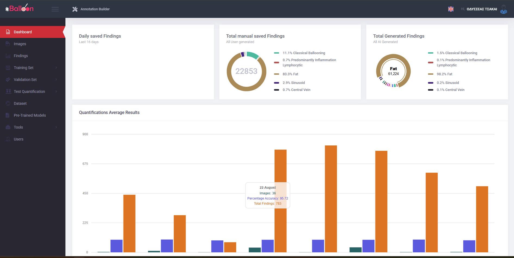

# X-Balloon Backend

The **X-Balloon Backend** is the central module of the X-Balloon framework, responsible for managing datasets, user interactions, and API endpoints. It is built using the PHP Yii2 framework and provides a robust infrastructure for handling data related to image annotation and AI-driven workflows.

---

## Features
- Manages datasets, including training, validation, and testing sets.
- Handles user authentication and role-based access.
- Supports RESTful API for seamless interaction with frontend and AI modules.
- Integrates the **Image Annotator Module**, available in the `web/ai-parser/AttributeParser-X-Balloon` folder.

---

## Setup Instructions

### 1. Database Setup
1. Create a new database named **`x-balloon-test`** in your MySQL instance.
2. Import the `x-balloon.sql` file into the database:
   ```bash
   mysql -u [username] -p x-balloon-test < path/to/x-balloon.sql
   ```
### 2. Install Dependencies
Run the following command in the backend directory to install all necessary dependencies:

   ```bash
composer install
 ```
### 3. Application Configuration
   Update the database connection details in config/db.php to match your MySQL setup:

   ```bash
return [
    'class' => 'yii\db\Connection',
    'dsn' => 'mysql:host=localhost;dbname=x-balloon-test',
    'username' => 'your-username',
    'password' => 'your-password',
    'charset' => 'utf8',
];
 ```

### 4. Login Credentials
   Default login credentials:

Username: ai-brain <br/>
Password: ai
### 5. Accessing the Application
   Once the setup is complete, you can access the backend application in your browser:
   ```bash
http://localhost/x-balloon-backend/web
```
# Usage Instructions

Follow these steps to use the system:


1. **Create classification classes**  
   Define the classifications for your dataset.

2. **Add images**  
   Upload the images you want to annotate.

3. **Annotate them via the Annotation Builder**  
   Use the Annotation Builder to annotate your images.

4. **Create a dataset**  
   Group your annotated images into a dataset.

5. **Create a training set, also add the images to the training set**  
   Assign images to the training set for model learning.

6. **Create a validation set, also add the images to the validation set**  
   Assign images to the validation set for model evaluation.

7. **Run training from the X-Balloon AI module**  
   Execute:
    ```bash
    python -m app.src.Application train
    ```

8. **Weight Files Upload**: As the training progresses, the system will automatically upload the paths to the generated weight files to the backend.
9. **Create Test Quantification**: Set up a test quantification and add the images on which you want the AI module to find annotations.
10. **Run AI Testing**: From the AI module, execute the testing command:
    ```bash
    python -m app.src.Application testing
    ```
11. **Annotations Upload**: The system will find the annotations on the test images and upload them to the backend.

12. **View Results:**
- You can view the system-generated annotations in the Annotation Builder by selecting the specific image.
- In the Quantification Images section, you can see a detailed view of the network's confidence for each annotation.# Image Annotator Module


# Image Annotator Module
The Image Annotator Module is included in the backend under the following directory:

```bash
web/ai-parser/AttributeParser-X-Balloon
```


## Licensing
Copyright (C) 2025 Odysseas Tsakai

This project is licensed under the GNU General Public License v3 (GPLv3).
See <https://www.gnu.org/licenses/>.

This project includes components from the Yii2 PHP Framework,
which is licensed under the BSD 3-Clause License.

Third-party components retain their original licenses.
